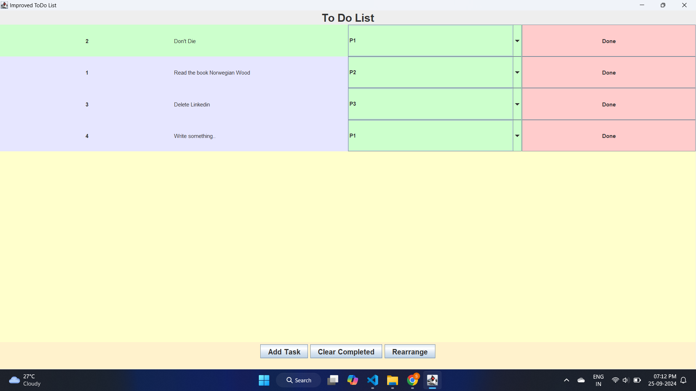

# 📝 Java To-Do List Application

This is a **simple To-Do List application** built with Java Swing. It provides an easy-to-use interface where users can manage daily tasks by adding, prioritizing, and marking tasks as completed. The tasks can also be rearranged according to priority and removed once completed.

---

## 🌟 Features

- **Add New Tasks** ➕: You can add new tasks to your list with a default or custom name.
- **Task Prioritization** ⚡: Assign priorities to tasks (P1, P2, P3) to organize them based on importance.
- **Mark Tasks as Done** ✅: Tasks can be marked as completed with a click of a button.
- **Remove Completed Tasks** 🗑️: Easily remove completed tasks to keep your list clean and up-to-date.
- **Rearrange by Priority** 🔄: Tasks can be sorted based on their priority, ensuring the most important ones are on top.

---

## 🖥️ User Interface Overview

- **Task List** 🗒️: Displays tasks along with their priority and status (completed or not).
- **Priority Selection** 🎯: You can set priorities for each task using a dropdown menu.
- **Buttons** 🔘:
  - **Done** ✅: Marks tasks as completed and changes their background color.
  - **Clear Completed** 🗑️: Removes all completed tasks from the list.
  - **Rearrange** 🔄: Sorts tasks based on their priority.

---

## 🛠️ Technologies Used

- **Language**: Java
- **GUI Framework**: Java Swing

---

## 📸 Screenshots

### 1️⃣ Main Task Window

This project demonstrates basic Java skills along with an understanding of how to create interactive GUI applications using the Java Swing library.
